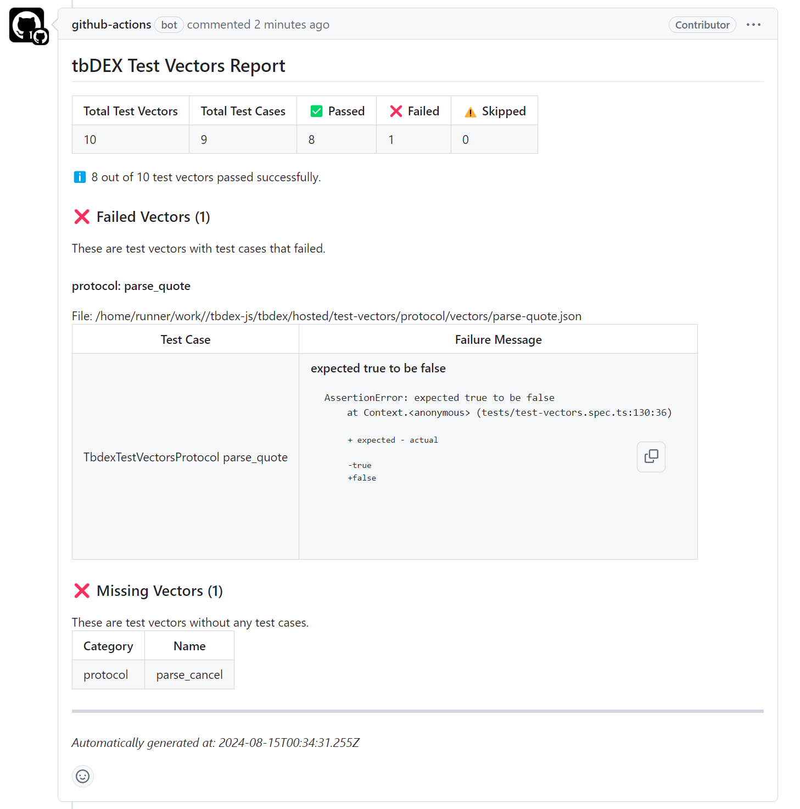

# tbd specs-report Action

[](./badges/coverage.svg)

GitHub Action to Parse and Generate tbd Specs Reports

## Usage

```yaml
# add it as an step on your CI workflow right after your tests

- name: Execute Spec Test Vector Report
   # assuming you have named the tests steps as `tests`
   # it will always run and report your tests results even if they failed
   if: always() && steps.tests.conclusion != 'skipped'
   uses: TBD54566975/tbd-sdk-report-runner/.github/actions/specs-report@main
   with:
      junit-report-paths: packages/*/results.xml # Glob Path with the JUnit test vectors report
      spec-path: tbdex # relative path to the tbd spec submodule folder
      fail-on-missing-vectors: true # if false, it will not fail the build if the test vectors are missing
      fail-on-failed-test-cases: true # if false, it will not fail the build if the test cases are failed
      comment-on-pr: true # if true, it will comment on the PR with the report
      git-token: ${{ secrets.GITHUB_TOKEN }} # the git token to use to comment on the PR
```

_Check the available parameters in the [action.yml](./action.yml) file_

Example report:



## Initial Setup

1. :hammer_and_wrench: Install the dependencies

   ```bash
   npm install
   ```

1. :building_construction: Package the TypeScript for distribution

   ```bash
   npm run bundle
   ```

1. :white_check_mark: Run the tests

   ```bash
   $ npm test
   ...
   ```

## Maintaining the Action Code

The [`src/`](./src/) directory is the heart of the action! This contains the
source code that will be run when your action is invoked.

There are a few things to keep in mind when writing your action code:

- Most GitHub Actions toolkit and CI/CD operations are processed asynchronously.
  In `main.ts`, you will see that the action is run in an `async` function.

  ```javascript
  import * as core from '@actions/core'
  //...

  async function run() {
    try {
      //...
    } catch (error) {
      core.setFailed(error.message)
    }
  }
  ```

  For more information about the GitHub Actions toolkit, see the
  [documentation](https://github.com/actions/toolkit/blob/master/README.md).

For information about versioning your action, see
[Versioning](https://github.com/actions/toolkit/blob/master/docs/action-versioning.md)
in the GitHub Actions toolkit.

## Publishing a New Release

This project includes a helper script, [`script/release`](./script/release)
designed to streamline the process of tagging and pushing new releases for
GitHub Actions.

GitHub Actions allows users to select a specific version of the action to use,
based on release tags. This script simplifies this process by performing the
following steps:

1. **Retrieving the latest release tag:** The script starts by fetching the most
   recent SemVer release tag of the current branch, by looking at the local data
   available in your repository.
1. **Prompting for a new release tag:** The user is then prompted to enter a new
   release tag. To assist with this, the script displays the tag retrieved in
   the previous step, and validates the format of the inputted tag (vX.X.X). The
   user is also reminded to update the version field in package.json.
1. **Tagging the new release:** The script then tags a new release and syncs the
   separate major tag (e.g. v1, v2) with the new release tag (e.g. v1.0.0,
   v2.1.2). When the user is creating a new major release, the script
   auto-detects this and creates a `releases/v#` branch for the previous major
   version.
1. **Pushing changes to remote:** Finally, the script pushes the necessary
   commits, tags and branches to the remote repository. From here, you will need
   to create a new release in GitHub so users can easily reference the new tags
   in their workflows.
