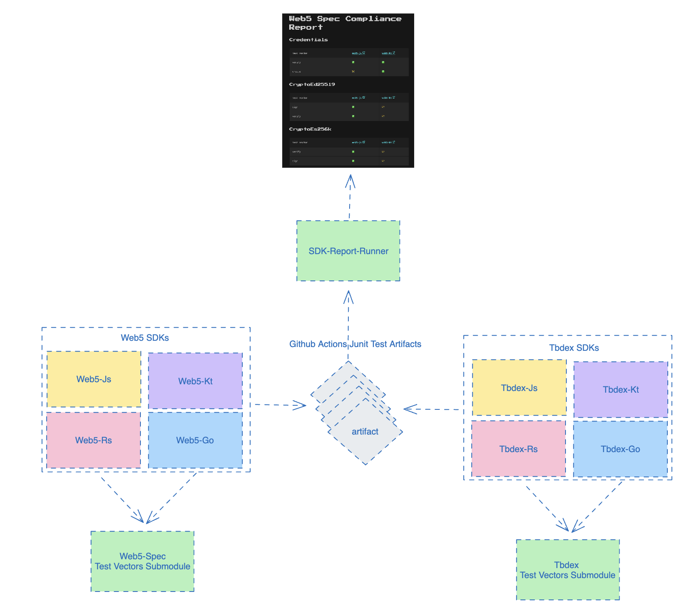

# SDK Report Runner
[Spec Compliance Report](https://tbd54566975.github.io/sdk-report-runner/)
## Overview
The SDK Report Runner is a specialized tool designed to evaluate SDKs against predefined test vectors. This repository is structured to clone submodules containing test vectors, subsequently generating a comprehensive report to ascertain if the SDK passes the specified tests.

This document provides an overview of the reporting system for Web5 and Tbdex SDKs. The system is designed to ensure that the SDKs adhere to the specifications and standards defined for Web5 and Tbdex protocols.

## Architecture
The architecture consists of several key components working together to validate and report the compliance of the SDKs.

### Components
* Web5 SDKs: The SDKs for Web5, including implementations in JavaScript (Web5-Js), Kotlin (Web5-Kt), Rust (Web5-Rs), and Go (Web5-Go).
* Tbdex SDKs: The SDKs for Tbdex, with implementations in JavaScript (Tbdex-Js), Kotlin (Tbdex-Kt), Rust (Tbdex-Rs), and Go (Tbdex-Go).
* Test Vectors Submodule: Both Web5 and Tbdex have their own sets of test vectors, which are utilized to validate the SDKs against the specifications.
* GitHub Actions/JUnit Test Artifacts: Automated tests are run via GitHub Actions, generating JUnit test artifacts.
* SDK-Report-Runner: A central component that collates test results and generates compliance reports.

### Workflow
1. The Web5 and Tbdex SDKs are developed in their respective languages.
2. Each SDK uses a submodule containing test vectors specific to their domain (Web5 or Tbdex) to verify compliance.
3. GitHub Actions is set up to run automated tests on these SDKs, producing JUnit test artifacts.
4. The SDK-Report-Runner aggregates these artifacts and analyzes them.
5. Based on the analysis, it generates two separate compliance reports for Web5 and Tbdex, which give insights into the SDKs' adherence to their respective specifications.
